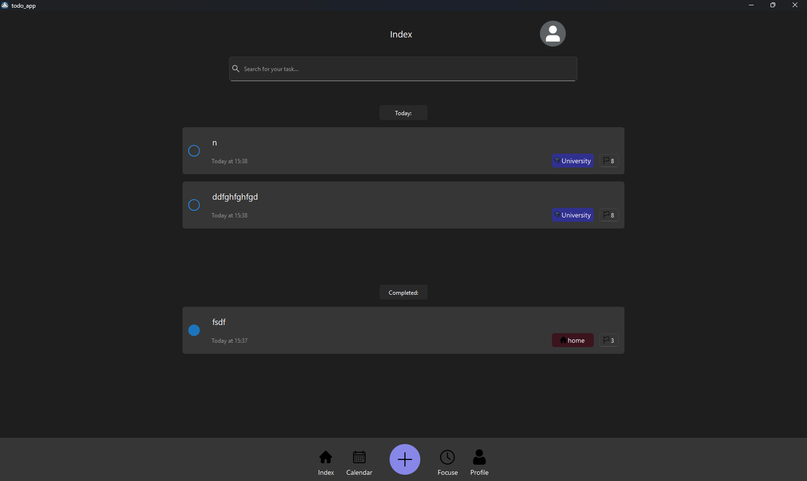
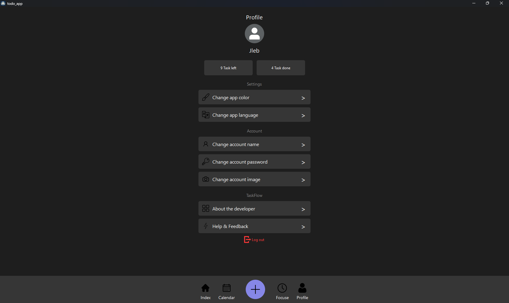

# 🧭 TaskFlow

**TaskFlow** is a minimalist and stylish desktop application that helps you organize your day by creating tasks, prioritizing them, and tracking your progress. The user-friendly interface, categories, and priority system make planning fast and efficient.

**Design** - by Amir Baghestani
---

## 🚀 Opportunity

- ✅ Adding tasks with title and description
- 🎨 Support for categories with icons and colors
- ⚡ Setting priority for tasks
- 📅 Просмотр задач по дню в календаре
- 🔄 View tasks by day in the calendar
- 🌙 Support for custom theme
- 🔔 Error warning

---

## 🖼️ Screenshots

---

## 🛠️ Installation and assembly

### 📦 Dependencies

- Qt 5 or 6
- CMake
- C++ compiler (GCC, MSVC, clang and other.)

